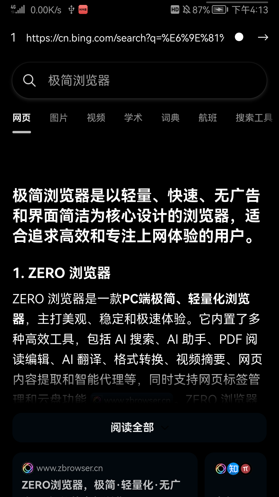
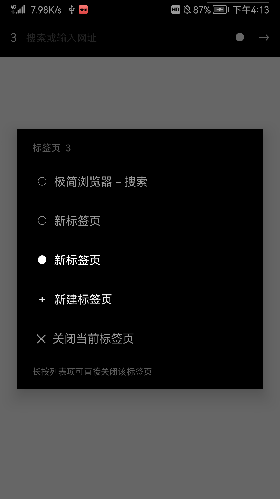

# Min Browser

> **20.5 KB 的安卓浏览器。零依赖，纯黑，省电。**

一个给 AMOLED 屏幕和极客用的极简浏览器。不打包任何浏览器内核，直接复用系统 WebView —— 所以它小到不像一个 App。


---

## 为什么它这么小

| 常见做法 | Min 的做法 |
|---|---|
| 打包 Chromium / Gecko 内核（几十~上百 MB） | **复用系统 WebView**，零内核体积 |
| 引入 AndroidX / Material（+ 1~3 MB） | **零第三方依赖**，只用系统 framework API |
| XML 布局 + 资源文件 | **全部代码构建 UI**，无 layout 资源 |
| Gradle 构建出大量元数据 | 手动 `aapt2 → javac → d8`，**无 Gradle** |

最终 APK 里只有 4 个文件：

```
AndroidManifest.xml          3,340 字节
classes.dex                 17,956 字节
res/mipmap-xxxhdpi/ic.png      771 字节
resources.arsc                 576 字节
                            ─────────
                            22,643 字节（未压缩）
APK 实际大小（zip 压缩后）    20,953 字节  (20.5 KB)
```

## 实测数据

在 **HUAWEI Mate 9 Pro（Android 9 / EMUI 9.1）** 上实测：

| 指标 | 数值 | 说明 |
|---|---|---|
| **APK 体积** | **20,953 字节** | 约等于一张缩略图 |
| **应用自身 Dalvik Heap** | **≈ 1.3 MB** | `dumpsys meminfo` 实测 |
| dex 大小 | 17,956 字节 | |
| 整进程 PSS | ≈ 67 MB | 绝大部分是系统 WebView 引擎，**系统已有、多应用共享**，Min 不额外带来引擎开销 |

> 对比：同机上的 DeepSeek App 整进程 PSS ≈ 93 MB。Min 的 67 MB 里，真正的「Min 代码」只占约 1.3 MB。

## 特点

### 🖤 纯黑，是真黑

UI 与网页内容统一使用 **`#000000`**，不是 `#1A1A1A` 那种深灰。

工具条、状态栏、导航栏、背景全部写死 `#FF000000`。

### 🔋 省电

AMOLED 屏幕上黑色像素**不发光**，纯黑背景相比深灰能显著降低屏幕功耗。

网页侧还有一层可开关的**强制纯黑**：

```
浅色网页 ──[ invert + hue-rotate ]──> 纯黑背景 + 浅色文字
```

实测一个纯白底页面（`#FFFFFF`）加载后，屏幕 **97.35%** 的像素变成 `#000000`。

> **实现上的一个坑**：`filter` 必须加在 `body` 上，`html` 的背景单独写死 `#000`。
> 如果把 `filter` 加在 `html` 上，Chromium 的 canvas 底色**不参与过滤**，大片浅色底不会被反相
> —— 我们踩过这个坑，纯黑占比只有 12%，加在 `body` 之后才到 97%。

### ⬇ 下载

接管 WebView 的 `setDownloadListener`，落盘交给系统 `DownloadManager` —— 不自己写 IO，也不多要一个权限。

- 自动带上 **UA / Cookie / Referer**：论坛附件、网盘直链缺了这三个基本 403
- 文件名按 `Content-Disposition` 推断，存进系统**下载**目录，通知栏可见
- 权限按需申请：Android 6~9 弹一次存储授权；**Android 10+ 完全不需要**（文件由系统 DownloadProvider 落盘）
- 标签页面板里有「↓ 下载内容」，直接跳系统下载管理器
- 非 `http(s)` 链接（`tel:` `mailto:` `weixin:` 等）甩给系统，以前点了没反应
- `intent://` 仍然放行给 WebView 自己解析 —— 用 `ACTION_VIEW` 硬传拉不起 App

### ⚡ 极简

- **多标签页**：长按标签按钮直接新建；点按打开面板切换 / 关闭
- **后台标签自动 `onPause()`**，不偷跑 JS 定时器
- 地址栏自动全选，点一下直接输入新网址
- 搜索用 **Bing（cn.bing.com）**，国内直连
- 地址栏输入无点号的词 → 走搜索；有点号 → 当网址访问
- 返回键 = 网页后退

## 截图

| 浏览（纯黑模式） | 标签页管理 |
|---|---|
|  |  |

## 安装

```bash
adb install -r Min.apk
```

或直接下载 [Releases](../../releases) 里的 APK 手动安装。

- `minSdk 21`（Android 5.0+）
- `targetSdk 28`
- 只需要 `INTERNET` 一个权限
- 注册为 `http` / `https` 默认处理器，可作为默认浏览器

## 构建

不依赖 Gradle，只需要 JDK 17+ 和 Android SDK。

```bash
# 需要：
#   JDK 17+
#   Android SDK: build-tools + platforms/android-28

ANDROID_SDK_ROOT=/path/to/android-sdk bash app/build.sh
```

脚本自动探测 `ANDROID_SDK_ROOT` / `ANDROID_HOME`，也支持常见默认路径。

产物在 `app/build/Min.apk`。首次构建会自动生成自签名密钥库 `app/min.keystore`。

### 源码结构

```
app/
├── AndroidManifest.xml            权限、Activity、http/https intent-filter
├── build.sh                       构建脚本（aapt2 → javac → d8 → zipalign → apksigner）
├── make_icon.py                   图标生成器（手写 PNG 编码，无第三方库）
├── res/mipmap-xxxhdpi/ic.png      图标
└── src/com/blk/min/Main.java      全部逻辑，单文件
```

## 已知限制

诚实地说清楚：

1. **强制纯黑是反相方案**：浅色网站会变纯黑，但**本身就是深色的网站会被反转成浅色**。这是 `invert` 的固有特性。遇到排版异常的网站，点工具条上的 `●` 关掉即可。
2. `filter` 会使 `body` 成为新的包含块，**个别网站的 `position:fixed` 悬浮元素可能错位**。
3. 无广告拦截、无隐私模式、无书签 —— 这是刻意的取舍。
4. 下载由系统 `DownloadManager` 执行，所以**不提供自定义保存路径、暂停/续传控制**；网页用 JS 生成的 `blob:` 下载它抓不到，这类按钮仍然点了没反应。下载失败的提示只给一行 toast，没有详情。
5. 复用系统 WebView，因此**渲染能力取决于系统 WebView 版本**。

## 更新日志

### 2.2 — 2026-09-12

- 新增下载：`setDownloadListener` + 系统 `DownloadManager`，带 UA / Cookie / Referer，落盘到公共下载目录
- 新增存储权限按需申请（仅 Android 6~9），manifest 增加 `WRITE_EXTERNAL_STORAGE`（`maxSdkVersion=28`）
- 新增纯黑 toast 提示（下载开始 / 失败 / 权限被拒），不用系统深灰 toast
- 标签页面板新增「↓ 下载内容」入口
- 非 `http(s)` scheme 链接改为交给系统处理
- dex 14,496 → 17,956 字节，APK 16,857 → 20,953 字节

### 2.1

- 多标签页、纯黑 UI、强制网页纯黑、Bing 搜索

## 路线图

- [x] 下载管理（接管 `setDownloadListener`）
- [x] 鸿蒙版（ArkTS + ArkWeb，见 [`harmony/`](harmony/)）
- [ ] 主页设置
- [ ] 纯黑模式按站点白名单
- [ ] 自适应图标（adaptive icon）

## 鸿蒙版（HarmonyOS）

仓库里还有一个用 **ArkTS + ArkWeb** 重写的鸿蒙版，产出可安装的 `.hap`（`bundleName: com.mrgeng.minbrowser`）。

鸿蒙**不跑 APK**，所以它不是 APK 转换，而是按鸿蒙 API 重新实现的一套：`Web` 组件替代 WebView、`WebDownloadDelegate` 替代 DownloadManager，**「强制纯黑」用的是同一份注入脚本**。功能与 Android 版对齐：多标签、纯黑 UI、强制网页纯黑、Bing 搜索、下载。

- 工程与构建说明：[`harmony/README.md`](harmony/README.md)
- 两端对照、真机实测数据、踩坑记录：[`docs/v2.2-changes.md`](docs/v2.2-changes.md)

## 界面说明

搜索框不在屏幕顶端，而是浮在**屏幕上下黄金分割位置**（从底部往上 61.8%）并左右居中，描边 `#7A7A7A` 与纯黑背景形成反差；右上角两个按钮分别是「强制纯黑开关」和「前往」，左上角竖向三点为标签页面板（长按直接新建标签页）。

## License

[MIT](LICENSE)

---

# Min Browser (English)

> **A 20.5 KB Android browser. Zero dependencies. Pure black. Battery-friendly.**

A minimal browser built for AMOLED screens and people who like small software. It bundles no engine — it reuses the system WebView, which is why it barely qualifies as an app.

- **20,953-byte APK**, 17,956-byte dex, **zero third-party dependencies**
- **Pure `#000000`** UI (not dark gray) — status bar, nav bar, toolbar, background
- **Force-dark for web pages**: inverts light pages to true black (measured 97.35% pure black on a white test page)
- **Multi-tab** with background tabs paused
- **Downloads** via `setDownloadListener` + the system `DownloadManager`, with UA / Cookie / Referer headers so logged-in attachments work; storage permission is requested only on Android 6–9
- Search via **Bing** (`cn.bing.com`)
- `minSdk 21`, `INTERNET` plus `WRITE_EXTERNAL_STORAGE` (`maxSdkVersion=28`)
- Measured **~1.3 MB app Dalvik heap**; total PSS ~67 MB, dominated by the shared system WebView

No Gradle. Build with `aapt2`, `javac`, `d8`, `zipalign`, `apksigner`:

```bash
ANDROID_SDK_ROOT=/path/to/android-sdk bash app/build.sh
```

Known limits: the force-dark uses CSS `invert`, so already-dark sites get flipped to light; `position:fixed` elements on some sites may shift. Downloads are handed to the system `DownloadManager`, so there is no custom save path or pause control, and JS-generated `blob:` downloads are not supported. No adblock, no bookmarks, no private mode — by design.

MIT licensed.
